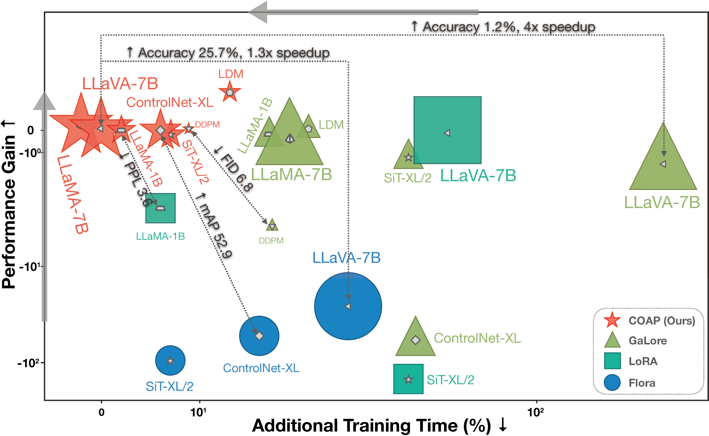

<p align="center">

  <h2 align="center">COAP: Memory-Efficient Training with Correlation-Aware<br>Gradient Projection</h2>
  <p align="center">
      <a href="https://scholar.google.com/citations?user=ITSm2LYAAAAJ&hl=en">Jinqi Xiao</a><sup>1,2</sup>
      ·
      <a href="https://ssangx.github.io/">Shen Sang</a><sup>1</sup>
    ·  
      <a href="https://tiancheng-zhi.github.io/">Tiancheng Zhi</a><sup>1</sup>
    ·  
       <a href="https://www.jingliu.net/">Jing Liu</a><sup>1</sup>
    ·  
     <a href="https://scholar.google.com/citations?user=0TIYjPAAAAAJ&hl=en">Qing Yan</a><sup>1</sup>
    ·  
    <a href="https://sites.google.com/view/yuqianzhang">Yuqian Zhang</a><sup>2</sup>
    ·  
     <a href="https://scholar.google.com/citations?user=fqubyX0AAAAJ&hl=en">Linjie Luo</a><sup>1</sup>
    ·  
     <a href="https://sites.google.com/site/boyuaneecs">Bo Yuan</a><sup>2</sup>
    <br>
    <br>
    <sup>1</sup>ByteDance Inc. &nbsp;<sup>2</sup>Rutgers University &nbsp;
    <br>
    </br>
        <a href="https://arxiv.org/abs/2412.00071">
        </a>
        <a href='https://byteaigc.github.io/coap/'>
        </a>
     </br>
     <h6 align="center">CVPR 2025</h6>
</p>


**COAP** (COrrelation-Aware Gradient Projection) is a memory-efficient training method that reduces computational
overhead without sacrificing performance. Tested on vision, language, and multimodal tasks, COAP delivers faster
training and better results than existing approaches—making it an ideal choice for scaling large models efficiently.

<br>

<p align="center">
  
  <br>
  <em>Comparison between COAP and other low-rank-based methods. The X-axis shows additional training time, with lower values being better. The Y-axis shows quantitative (e.g., FID, PPL) changes compared to the original optimizer (e.g., Adam, Adafactor) with higher values indicating better performance.
</em>
</p>

<br>

<p align="center">
  
  <br>
  <em>Profiling the GPU memory usage.</em>
</p>

<br>

## Installation

```bash
pip install -e .
```

## Usage

### Examples

We provide three examples (e.g. ControlNet-XL, DDPM, LLAMA) included in our main paper for reproducibility. Please refer to [examples](./examples/README.md) for more results.

- [DDPM](examples/ddpm#readme)
- [ControlNet-SDXL](examples/controlnet_sdxl#readme)
- [LLaMA-1B and LLaMA-7B on the C4 dataset](examples/llama#readme)

### How to use COAP in your code

Here are the main parameters for COAP:

- `optimizer`: The optimizer provided by COAP, including `coap_adamw`, `coap_adamw8bit`, `coap_adafactor`, `coap_adafactor8bit`.
- `rank`: The rank of the projected matrix.
- `rank_ratio_matrix`: The compression ratio of the 2D weight matrix (This will override the `rank` parameter).
- `rank_ratio_cnn`: The compression ratio of the 4D weight matrix of CNN layers.
- `update_interval`: The interval of updating the projection matrix.
- `reproject_factor`: The factor of re-projection.


```python
from coap_torch import CoapAdamW, CoapAdafactor

# AdamW
optimizer = AdamW(model.parameters(), lr=learning_rate)

# CoapAdamW
optimizer = CoapAdamW(params=model.parameters(),
                      lr=learning_rate,
                      rank_ratio_matrix=2,
                      rank_ratio_cnn=2,
                      update_interval=32,
                      reproject_factor=5)

# CoapAdafactor
optimizer = CoapAdafactor(params=model.parameters(),
                          lr=learning_rate,
                          rank_ratio_matrix=2,
                          rank_ratio_cnn=2,
                          update_interval=32,
                          reproject_factor=5)
```

Please refer to the [DDPM](./examples/ddpm/train_unconditional.py#L564) and [ControlNet-SDXL](./examples/controlnet_sdxl/train_controlnet_sdxl.py#L1165) examples for basic usage. A more advanced use case can be found in the [LLAMA example](./examples/llama/torchrun_main.py#L301).


## BibTeX
If you find [COAP](https://arxiv.org/abs/2412.00071) useful for your research and applications, please cite COAP using this BibTeX:
```bash
@misc{xiao2025coapmemoryefficienttrainingcorrelationaware,
      title={COAP: Memory-Efficient Training with Correlation-Aware Gradient Projection}, 
      author={Jinqi Xiao and Shen Sang and Tiancheng Zhi and Jing Liu and Qing Yan and Yuqian Zhang and Linjie Luo and Bo Yuan},
      year={2025},
      eprint={2412.00071},
      archivePrefix={arXiv},
      primaryClass={cs.LG},
      url={https://arxiv.org/abs/2412.00071}, 
}
```

## License

Apache 2.0 License. See [LICENSE](./LICENSE) for details.
